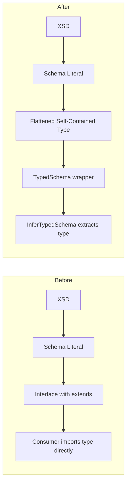

# Changelog: 2024-12-12 17:00

## Summary

Major refactoring of the type generation system in `ts-xsd` and `adt-schemas`. Introduced AST-based flattened type generation, resolved `isolatedDeclarations` incompatibility, and updated `adt-contracts` to use the new `InferTypedSchema` pattern for type extraction.

## Architecture

---

## Changes by Component

### `ts-xsd`

**What changed**: New AST-based type generation using ts-morph for fully flattened, self-contained types.

**Before → After**:

- **Before**: Generated interfaces with `extends` and cross-file imports
- **After**: Generates flattened types with all properties inlined

**Key decisions**:

- Use ts-morph for reliable AST manipulation
- Flatten all inherited types to avoid cross-schema dependencies
- Strip namespace prefixes from attributes (e.g., `xml:base` → `base`)

### `adt-schemas`

**What changed**: Disabled `isolatedDeclarations`, regenerated all types with flattening, removed intermediate type files.

**Before → After**:

- **Before**: `isolatedDeclarations: true`, types with inheritance
- **After**: `isolatedDeclarations: false`, flattened self-contained types

**Key decisions**:

- `isolatedDeclarations` incompatible with `as const satisfies Schema` pattern
- Remove unused intermediate types (`Ecore.types.ts`, `abapoo.types.ts`, `xml.types.ts`)
- Move `typedSchema` wrapper to `ts-xsd` package

### `adt-contracts`

**What changed**: Updated type imports to use `InferTypedSchema` pattern.

**Before → After**:

- **Before**: `import type { ClassAbapClass } from '../../schemas'`
- **After**: `import { type InferTypedSchema } from '../../schemas'` + `InferTypedSchema<typeof classesSchema>`

**Key decisions**:

- Use type inference from schema rather than importing raw types
- Cleaner API - consumers don't need to know internal type names

---

## Challenges & Resolutions

| Challenge                                                     | Resolution                                        |
| ------------------------------------------------------------- | ------------------------------------------------- |
| `isolatedDeclarations` requires explicit types for `as const` | Disabled `isolatedDeclarations` for adt-schemas   |
| Namespaced attributes (`xml:base`) causing invalid TS syntax  | Strip namespace prefix in `collectAttributes`     |
| Type cycles in flattening                                     | Added cycle detection with `Set<string>` tracking |
| Missing type exports (`ClassAbapClass`, `IntfAbapInterface`)  | Use `InferTypedSchema<typeof schema>` pattern     |

## Open Points

- [ ] Consider re-enabling `isolatedDeclarations` with different approach
- [ ] Add more test coverage for ts-morph type flattening

## Next Steps

- Run full test suite across all packages
- Commit and push changes

## Related

- Packages affected: `ts-xsd`, `adt-schemas`, `adt-contracts`

---

_Generated by: Cascade via `/log` workflow_
