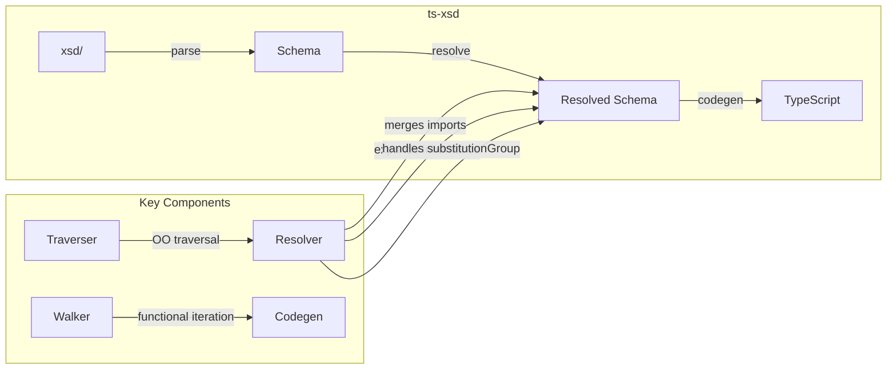

# Changelog: 2024-12-13 00:56

## Summary

Fixed circular reference stack overflow in ts-xsd type flattening (`expandTypeToString`), regenerated all adt-schemas with improved simpler types, and updated ts-xsd documentation to reflect current architecture including resolver, traverser, loader, and walker components.

## Architecture

---

## Changes by Component

### `ts-xsd/src/codegen/ts-morph.ts`

**What changed**: Added cycle detection in `expandTypeToString` function to prevent stack overflow on circular type references.

**Before → After**:
- **Before**: Interface lookups and base type expansion didn't track visited types, causing infinite recursion on complex schemas
- **After**: Added `visited` set tracking for interface name lookups and base type expansion

**Key decisions**:
- Return `unknown` when cycle detected (safe fallback)
- Track by type name/text representation for reliable cycle detection

### `adt-schemas/src/schemas/generated/`

**What changed**: Regenerated all 36 type files with new flattening logic.

**Before → After**:
- **Before**: Union types with unrelated alternatives (e.g., `| { mainObject } | { link }`)
- **After**: Single object type for root element only (cleaner, more correct)

**Key decisions**:
- Keep simpler generated types (5701 lines removed, 1916 added)
- All 44 tests still pass - no regressions

### `ts-xsd/README.md`, `AGENTS.md`, `docs/codegen.md`

**What changed**: Updated documentation to reflect complete architecture.

**Before → After**:
- **Before**: Missing resolver, traverser, loader, schema-like components
- **After**: Complete architecture with all modules documented

**Key decisions**:
- Added Key Components table (Resolver, Traverser, Walker, Loader)
- Removed obsolete speci reference
- Added adt-contracts and adt-plugin-abapgit to Related Packages
- Documented `flatten` option and cycle detection in codegen docs

---

## Challenges & Resolutions

| Challenge | Resolution |
|-----------|------------|
| Stack overflow on complex SAP ADT schemas (13 failures) | Added cycle detection in `expandTypeToString` for interface lookups and base type expansion |
| `typeName` variable out of scope in base type fallback | Used `textRepr` as cycle key instead |
| Generated types changed significantly | Verified all tests pass (adt-schemas: 44, adt-contracts: 172, adt-plugin-abapgit: 36) |

## Open Points

- [ ] `transportsearch.types.ts` has `requests?: string` due to XSD using `type="xsd:anyURI"` with `ecore:reference` annotation - may need ecore support
- [ ] Some `any` type parameters in ts-morph.ts (pre-existing, not introduced)

## Next Steps

- Consider adding `ecore:reference` annotation support for better type resolution
- Commit changes with semantic commit message

## Related

- Package: `@abapify/ts-xsd`
- Package: `@abapify/adt-schemas`

---
*Generated by: Cascade via `/log` workflow*
