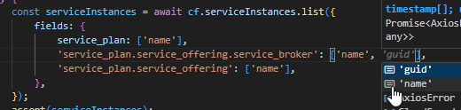

# [WIP] Cloud Foundry Client (V3)

This is a client for interacting with the Cloud Foundry API.

> This project is still in development, which means only few resourcess is implemented.
>
> Luckily it will very simple to contribute. Please read contribution guide below.

## Installation

```bash
npm i cf-api-client
```

## Usage

This library delivers a class, `CloudFoundryClient`, which can be used to interact with the Cloud Foundry API. It composes resources apis as nested clients.

```ts
import { CloudFoundryClient } from 'cf-api-client';
const client = new CloudFoundryClient({
  apiEndpoint: 'https://api.cf.us10-001.hana.ondemand.com',
  accessToken: 'bearer your_access_token',
});

const services = await client.serviceInstances.list();

console.log(JSON.stringify(services.data, null, 2));
```

For local testing, you can use the `getOauthToken` function to retrieve a new token and `getCFConfig` to retrieve target from CF CLI config.

```ts
import { getOauthToken, getCFConfig, CloudFoundryClient } from 'cf-api-client';
const config = await getCFConfig();
const token = await getOauthToken(config.Target);
const client = new CloudFoundryClient({
  apiEndpoint: config.Target,
  accessToken: token,
});
```

## Supported Resources

- Service Instances
- Service Credential Bindings

## Advanced programming

### Retrieve CF CLI config

getCFConfig allow you to read `~/.cf/config.json` and return as a fully-typed object.

```ts
import { getCFConfig } from 'cf-api-client';
const config = await getCFConfig();
console.log(config.Target);
```

### Retrieve new Oauth token from CLI

To get a new token for local testing we're supposed to call `cf oauth-token`.
With a following code we can do the same programmatically.

```ts
import { getOauthToken } from 'cf-api-client';
const token = await getOauth();
console.log(token);
```

# Contribution Guide

To onboard a new resource you need to:

- add a new resource folder to `src/api/resources`
- describe the resource types in a file like `src/api/resources/{resource_type}/types.ts`
- create api implementation for a resource in `src/api/resources/{resource_type}/api.ts`
- api client should be exteded from `BaseClient`
- we should indend to keep only a trully minimal mapping between the method interface and the actual http client call
- api client should be exported in `src/api/resources/index.ts`
- please try to utilize shared types whenever possible (defined in `src/api/resources/common.ts`)
- please return the result as a result of the axios ( this.client ) call, so we can get not only data as a result
- As a developer I personally prefer to develop with Sourcegraph Cody, and asking it to generate APIs following patterns from another files in a context

## Utility types

### PaginatedResponse

Almost every CF resource supports list operations with paginated responses. To unify the way we handle them a special utility type is provided.

```ts
 list = (params?: {
        names?: string[],
        service_instance_guids?: string[],
        service_instance_names?: string[],
        ...
    }) => this.client.get<PaginatedResponse<ServiceCredentialBinding>>('/v3/service_credential_bindings', { params })
```

### AllowedFields

Some endpoints support a special [fields](https://v3-apidocs.cloudfoundry.org/version/3.181.0/index.html#fields-parameter) query parameter, which allows to specify which fields should be returned.

These fields are specific per resource and described in a format like this:
| Resource | Allowed Keys |
|----------|--------------|
| space | guid, name, relationships.organization |
| space.organization | guid, name |
| service_plan | guid, name, relationships.service_offering |
| service_plan.service_offering | guid, name, description, documentation_url, tags, relationships.service_broker |
| service_plan.service_offering.service_broker | guid, name |

So what we do in code, to support such a parameter, is to define a type like this:

```ts
//defined allowed fields as a type in a following map format
type allowed_fields = {
  space: ['guid', 'name', 'relationships.organization'];
  'space.organization': ['guid', 'name'];
  service_plan: ['guid', 'name', 'relationships.service_offering'];
  'service_plan.service_offering': [
    'guid',
    'name',
    'description',
    'documentation_url',
    'tags',
    'relationships.service_broker'
  ];
  'service_plan.service_offering.service_broker': ['guid', 'name'];
};

// use this type in a method signature
list = (params?: {
        ...
        // only values from allowed_fields
        fields?: AllowedFields<allowed_fields>,
    }) => this.client.get<PaginatedResponse<ServiceInstance>>('/v3/service_instances', { params })
```

as a result in your code you'll be able to use like this:

```
  const serviceInstances = await cf.serviceInstances.list({
                fields: {
                    service_plan: ['name'],
                    'service_plan.service_offering.service_broker': ['name'],
                    'service_plan.service_offering': ['name'],
                },
            });
```

A nice feature is that you'll be able to use autocomplete in your IDE.


and as a result this code will trigger the URL like this (formatted for better understanding):

```
https://api.cf.us10-001.hana.ondemand.com
/v3/service_instances?
fields[service_plan]=name&
fields[service_plan.service_offering]=name&
fields[service_plan.service_offering.service_broker]=name&
page=1&
per_page=50
```
